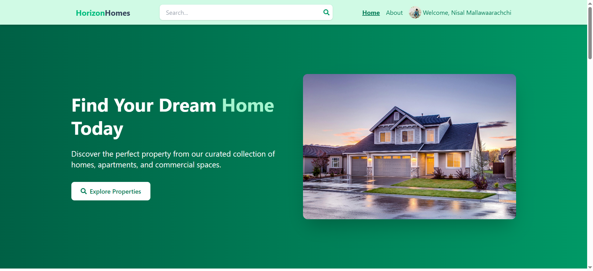
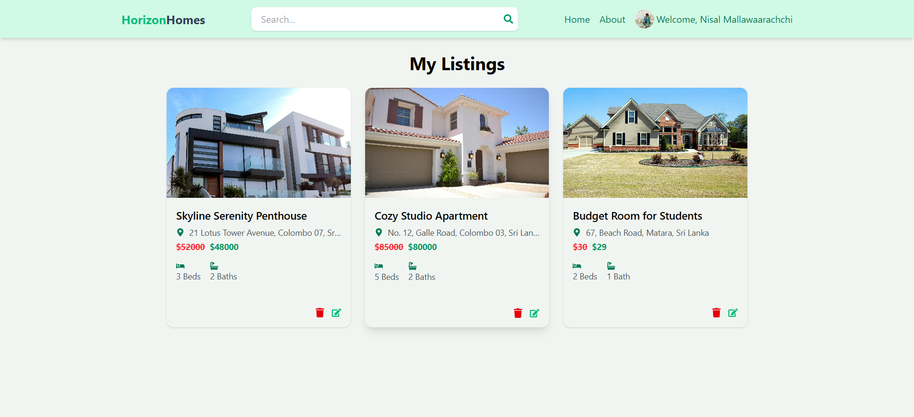

# 🏡 Horizon Homes – Real Estate Listing App

A full-stack real estate listing platform where users can search, post, and manage properties for rent or sale. Built with **React**, **Tailwind CSS**, **Node.js**, and **Firebase**, Horizon Homes delivers a clean and responsive user experience.

---

## 🔗 Live Demo

👉 [Visit the Live App](https://horizon-homes-0kuz.onrender.com/)  
👉 [GitHub Repository](https://github.com/NisalMallawaarachchi/horizon-homes)

---

## 📸 Screenshots

| Home Page                          | Listing Page                        |
|-----------------------------------|-------------------------------------|
|    |  |

> Add screenshots inside a `screenshots` folder to visually showcase your app.

---

## 🚀 Features

- 🔍 Filter listings by type, parking, offer, and furnishings
- 🔐 Firebase Authentication (sign up, sign in, sign out)
- 🏠 Create, update, and delete your listings
- 📸 Image upload with Firebase Storage
- 🎉 Toast notifications for actions and feedback
- 📱 Mobile-first and fully responsive with Tailwind CSS

---

## 🛠️ Tech Stack

| Frontend        | Backend       | Auth & DB           | Deployment              |
|-----------------|---------------|----------------------|--------------------------|
| React + Tailwind CSS | Node.js + Express | Firebase (Auth, Firestore, Storage) | Render (Backend) + Firebase (Cloud) |

---

## 📦 Local Setup Instructions

To run Horizon Homes locally:

```bash
# 1. Clone the repository
git clone https://github.com/NisalMallawaarachchi/horizon-homes.git
cd horizon-homes

# 2. Install backend dependencies
cd api
npm install

# 3. Install frontend dependencies
cd ../client
npm install

# 4. Go back to root and start the development environment
cd ..
npm run dev
